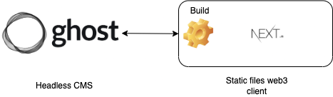

# Overview

Open Source web3 client that consumes the content of a headless CMS and displays information based on the tokens you have or your activity in blockchain. This functionality enables the gamification of communities and their effective use, being able to discriminate access to content based on the behavior of each user to the community, having been all recorded in the blockchain.

# Features


* Connection with Ghost to retrieve the content (pages, posts, tags, authors and navigation).
* web3 login.
* Discrimination of content by web3 based on:
    * NFTs held by the user.
    * ERC20 tokens held by the user.
* Content discrimination management administration (content relationship with NFTs, erc20, etc).

# Tech stack

* Next.js with the following packages:
    * XXX
* Ghost CMS (headless).

# Architecture




# 🏁 Getting Started

```bash
git clone https://github.com/styxlab/next-cms-ghost.git
cd next-cms-ghost
yarn

# Development
yarn dev

# Production
yarn build
```
## Building locally

Create a new text file `.env.local` in the project root folder with the following content:

```
CMS_GHOST_API_URL=http://localhost:2368
CMS_GHOST_API_KEY=9fccdb0e4ea5b572e2e5b92942
```

# 🤯 Ensure headless mode of Ghost CMS

For best SEO results it is strongly recommended to disable the default Ghost Handlebars theme front-end by selecting the _Make this site private_ flag within your Ghost admin settings.

&nbsp;

# 💣 Reporting issues

Please report all bugs and issues at [next-cms-ghost/issues](https://github.com/Mircala/web3-ghost-template/issues).

&nbsp;

# Additional documentation

[Ghost docs: Getting Started](https://ghost.org/help/topic/setting-up/)

## For writers and editors

[How to write and publish content on ghost](https://ghost.org/resources/how-to-publish-your-first-post/)

[A pre-publishing and post-publishing guide for new writers](https://ghost.org/resources/newsletter-checklist/)

[How to format a blog post: A complete guide for new writers](https://ghost.org/resources/how-to-format-a-blog-post/)


## Ghost for admins or technical staff

[Ghost github repo](https://github.com/TryGhost/Ghost)

[Official ghost image container](https://hub.docker.com/_/ghost/)
